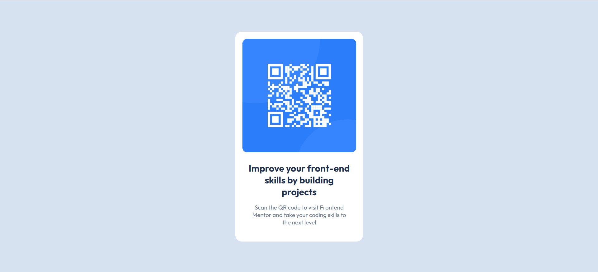

# Frontend Mentor - QR Code Component Solution

This is a solution to the [QR code component challenge on Frontend Mentor](https://www.frontendmentor.io/challenges/qr-code-component-iux_sIO_H). Frontend Mentor challenges help you improve your coding skills by building realistic projects.

## Table of Contents

- [Overview](#overview)
  - [The Challenge](#the-challenge)
  - [Screenshot](#screenshot)
  - [Links](#links)
- [My Process](#my-process)
  - [Built With](#built-with)
  - [What I Learned](#what-i-learned)
- [Author](#author)
- [Acknowledgments](#acknowledgments)

---

## Overview

### The Challenge

The challenge is to build out a QR code component and get it looking as close to the design as possible.

Users should be able to:

- View the optimal layout depending on their device's screen size

### Screenshot

### Links

- Solution URL: [https://aarzoo04.github.io/fem-QR_code_component/](#https://aarzoo04.github.io/fem-QR_code_component/)

---

## My Process

### Built With

- Semantic HTML5 markup
- CSS custom properties
- Flexbox

### What I Learned

Working on this challenge, I learned:

1. How to structure a simple card component using HTML and CSS.
2. Effective use of CSS properties like `border-radius`, `text-align`, and `max-width` to achieve responsive designs.
3. Better understanding of font imports and managing font weights to match design specifications.

## Author

Frontend mentor - [@Aarzoo04](#https://www.frontendmentor.io/profile/Aarzoo04)

## Acknowledgments

Thank you to Frontend Mentor for providing such a great platform to practice coding skills. This challenge was a great way to reinforce foundational CSS and HTML knowledge.

Special thanks to [this YouTube tutorial](https://www.youtube.com/watch?v=5BBYPntB-GY&list=PLcZZlEf3w738Bv45a8yI_iIv2OGx_JLvz&index=11) for guiding me through the project and helping me understand key concepts more effectively.

